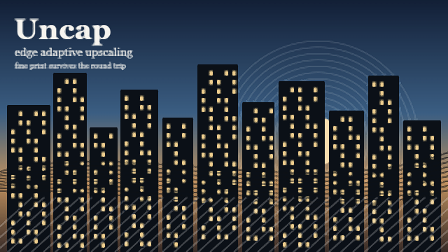

<div align="center">


# Uncap

Streaming players guess what your machine can handle, guess low, and never tell you.
Uncap corrects the guess, then sharpens whatever comes back.

</div>

| Browser upscale | Uncap |
| --- | --- |
|  |  |

A 640 by 360 master was area downscaled to 320 by 180, the way an encoder would, and brought back
to 640 by 360 twice. On the left is the plain bilinear stretch a browser gives a video that does not
fill its box. On the right is EASU, then the restore pass, then RCAS, all from `src/gpu.js`. Look at
the fine print under the title: it is legible on one side and mush on the other.

## What it does

It raises the ceiling first. Netflix and YouTube pick your resolution, codec, bitrate and audio
format from a handful of signals they read out of the browser: screen size, DRM robustness, codec
support, spatial audio support. Uncap answers those signals with the best answer the session can
actually carry, so the server sends a better stream to begin with.

Then it enhances what arrives. A WebGL2 filter resamples the frame to your display's real pixel
count and sharpens it without haloing, and will fill in the frames between the ones that were sent
if you ask it to.

Then it tells you what happened. The popup shows what you are getting, and when you are not getting
the best, which link in the chain gave way.

No upscaler recovers detail that was never streamed, which is why the order matters.

## Install

Load it unpacked while the store listings are pending.

1. Download the latest `uncap-chrome.zip` from [releases](../../releases) and unzip it, or clone
   this repository.
2. Open `chrome://extensions` or `edge://extensions` and turn on developer mode.
3. Choose load unpacked and select the folder.
4. Open a video. Tabs you already had open on Netflix or YouTube reload themselves.

Firefox users want `uncap-firefox.zip`, which is the same source with an event page instead of a
service worker. It needs Firefox 128 or newer for main world content scripts.

There is no build step, nothing to download at runtime, and no settings screen to go hunting for.
The repository is the extension and the toolbar popup is the whole interface.

| Shortcut | |
| --- | --- |
| `ctrl + alt + O` | Rest Uncap, or wake it |
| `ctrl + alt + U` | Show the readout in the corner of the page |
| `ctrl + alt + E` | Walk the enhancer through off, balanced, sharp, anime, custom |
| `ctrl + alt + X` | Split the picture to compare, then drag the seam |

All four are yours to change under settings. They are handled on the page, which is where the video
is, and they read the physical key rather than the character it produces, so a non US keyboard works
the same. In a text field they stand aside entirely, which also means `alt gr` keeps typing whatever
your layout puts on those letters.

Chrome will not let an extension register `ctrl + alt` at the browser level, because on Windows that
pair is `alt gr`. So the four commands ship with no browser shortcut at all rather than one you did
not ask for. If you want them to work while the page does not have focus, give them keys of your own
at `chrome://extensions/shortcuts`.

## The enhancer

Five settings, one click apart.

Off leaves the picture exactly as the player sends it. Balanced is a light sharpen that suits live
action. Sharp pushes the same filter harder for soft or heavily compressed sources. Anime adds line
darkening, line thinning, a light denoise and a deband on top. Custom gives you all six controls on
their own sliders.

| Control | What it does |
| --- | --- |
| Sharpen | RCAS, the sharpener AMD built to follow an upscale, with its own noise gate |
| Deblur | Adds back the detail a compressed encode lost, clamped so it cannot overshoot its own neighbourhood |
| Line darkening | Thickens and darkens line art using the luma heightmap idea from Anime4K |
| Line thinning | Warps each sample along the luma gradient, which pulls bright detail into dark lines |
| Denoise | A three by three bilateral pass that keeps edges and flattens grain |
| Deband | Replaces a pixel with its wide neighbourhood average where the neighbourhood is flat, plus a small dither |

The first pass is EASU, the edge adaptive spatial upsampling half of AMD's FidelityFX Super
Resolution 1.0, which is MIT licensed. Rather than applying one fixed kernel everywhere, it reads a
twelve tap neighbourhood, measures the luma gradient in all four quadrants around the output
position, and builds an elliptical kernel stretched along whatever edge it found. A diagonal line
gets filtered along the diagonal instead of across it, which is exactly where a bicubic kernel
produces stairsteps. The result is then clamped to the range of the four nearest input pixels, so
the kernel's negative lobes cannot ring.

The sharpen pass is RCAS from the same suite. It works out, per channel, how far it can push each
pixel before any neighbour would clip, takes the tightest of the three, and sharpens by that. It
also measures how much of the local variation is noise rather than signal and halves its strength
where the answer is noise, which matters on a compressed stream where a plain unsharp mask would
amplify the blocking.

Deblur, line thinning and denoise share one pass, and everything that pass writes is clamped to the
minimum and maximum of the pixel's own three by three neighbourhood. That is the idea behind
Anime4K's highlight clamp: a line reconstruction filter can sharpen a line as hard as it likes, but
it can never invent a value brighter or darker than what was already around it, so no halo appears
where one did not exist.

### Output size

Auto measures rather than asking. The canvas sits at the size of the video box on screen, so the
only pixels that reach your eye are the box times your device pixel ratio. Rendering an 8K buffer
into a 4K box draws four pixels for every one the monitor can show and throws three away. So Auto
renders at your display's real pixel count, caps at 3840 by 2160, and prints the ratio it worked
out. A 1080p source in a 4K window reads `2x larger`. A 4K source in a 4K window reads `same size,
sharpening only`, which is the truth, and the sharpen pass is still worth having.

Native leaves the frame at its own resolution and runs the filter there, which is what you want when
the player box is small but you are about to go fullscreen. The fixed heights, 1080p through 4K,
lock the output and keep the source aspect.

When the window is smaller than the video the resample switches filters rather than giving up. A
bicubic kernel is built for magnification and aliases badly on the way down, so below a ratio of one
the pass becomes an area average instead: two to four bilinear taps spread across the output pixel's
whole footprint in the source, which is a real box filter, not a point sample. The sharpen pass then
runs on the result, and that is the part the browser's own compositor does not do. A 4K stream in a
1080p fullscreen reads `0.5x down` and still gets sharpened.

There is a floor at three tenths. Past that the source is more than three times the player in each
direction, uploading a frame that large every refresh costs more than the picture gains, and the
enhancer stands down and says so.

Cost is measured every frame and shown in milliseconds. It runs on `requestVideoFrameCallback`, so
there is exactly one pass per decoded frame, nothing while the video is paused, and nothing while
the tab is hidden.

## Smooth motion

Film runs at 24 frames a second and your monitor does not. The gap is what makes a slow pan judder.
Smooth motion fills it in: Uncap keeps the last two decoded frames, works out where each part of the
picture moved between them, and draws the in between frames your monitor has room for. It sits under
advanced, off until you ask for it.

Auto draws one new frame for every refresh your monitor has. Uncap measures that rate rather than
assuming it, by timing a short burst of animation frames and rounding to the nearest real panel
rate, and measures it again whenever the window moves or resizes, which is what happens when you
drag it to a second monitor. On a 120 hertz panel, Auto turns 24 fps film into 120.

The fixed rates are there for machines that cannot afford Auto. `2x`, `3x` and `4x` cap the output at
that multiple of the source, and the pass simply does not run for a refresh that would land on a
frame it has already drawn, so `2x` on 24 fps film costs two frames of work where Auto costs five.
The popup prints the rate it actually reached, not the one you asked for.

### How the motion is found

There is no model and nothing to download. The estimator is a pyramidal bidirectional block search
written against WebGL2, so it runs on the same context as the rest of the filter and needs neither
WebGPU nor a particular GPU feature.

Both frames are reduced to luma at half the video's resolution, and the mip chain of that texture is
the pyramid. The search then runs coarse to fine over three rungs, at a sixteenth, an eighth and a
quarter of the video's width, each rung reading the luma at the matching level of detail and matching
a five tap cross rather than a single sample. Each rung starts from the rung above, refines over
eight directions at halving radius, and lands with a reach of roughly a hundred pixels of full
resolution motion.

Two rules keep it honest, and both exist because the naive version drifts.

Every rung tests the coarse guess against standing still and starts from whichever is cheaper. A
coarse rung with nothing to lock onto, which is what a flat sky or a blurred pyramid level looks
like, would otherwise hand a large wrong vector to every rung below it, and the finer rungs do not
have the reach to undo it.

A candidate has to beat the incumbent by one percent to be taken. On a flat cost surface the
differences between candidates are noise, and a plain `less than` comparison follows that noise a
step at a time until the vector has wandered a long way from zero.

The field is stored as sixteen bits per component packed across the four bytes of an ordinary RGBA8
target, so there is no dependency on float render targets and no fallback path to maintain. Half a
pixel of precision would not be enough to place a subpixel edge; this gives far more than is needed.

### Where it refuses

Guessing motion goes wrong, and when it does the usual result is a ghost: two half transparent
copies of a moving object. Uncap does not blend on faith. Four guards sit in front of the blend, and
the worst case each one protects against is the picture you would have seen without the feature,
never a smear.

**Nothing still is ever warped.** Subtitles, station logos, letterbox bars and held backgrounds do
not move, but a block search will happily find spurious motion in them and wobble the text. So
before anything else the pass compares the two frames at the same pixel. Where they already agree,
the answer is a plain time blend with no displacement at all, which for a genuinely still pixel is
that pixel exactly. Measured on a still caption over a moving background: zero error at every phase
tested.

**The forward and backward fields have to agree.** Both directions are estimated. Where the vector
found at a pixel does not cancel the vector found at the place it points to, that pixel is occluded
or the match was wrong, and it falls back to the nearest real frame. This is what stops the halo
around a moving object where background is being uncovered.

**The two warped samples have to agree.** The blend samples both frames along the vector it was
given and compares them. Where they disagree, the guess was wrong.

**A cut stands the whole thing down.** The mean difference between the two frames is reduced on the
GPU through a mip chain, and a value above a fifth of full range fades the interpolation out
entirely. Measured against the two cases that have to be told apart: a fully textured frame shifted
sixteen pixels reads 0.15, while a hard cut between unrelated frames reads 0.34.

The vector field is also smoothed before it is used. Block search produces one vector per block, and
neighbouring blocks disagree, which is what tears a moving object along block boundaries. The blend
pass reads five taps of the field with the centre weighted eight to one and uses the average.

### What it measures

On a synthetic pair where a fully textured frame moves sixteen pixels, the halfway frame puts the
moving edge one pixel from the exact halfway position, and the recovered field reads sixteen pixels
to the tenth in textured regions. A still caption over that same moving background comes through
with zero error at a quarter, a half and three quarters of the way between frames. A hard cut comes
through as the nearer real frame with zero drift.

### When it runs at all

Both rates are snapped to real ones before any of this is decided. A source measured at 23.98 is 24,
one at 29.97 is 30, and a panel measured at 59.9 is 60. Film and broadcast rates are the NTSC
fractions, not the round numbers, and a rate estimate that wanders by a hundredth every second makes
the phase wander with it.

Whether there is anything to gain is decided against your monitor, not against a fixed frame rate.
Uncap divides the refresh rate it measured by the rate the source is decoding at, and only
interpolates when that leaves half a frame of room or better. So 60 fps video is skipped on a 60
hertz panel, where it already fills every refresh, and interpolated on a 120 hertz one, where it
fills half of them. Anything above 90 fps at source is left alone outright.

Cost is handled by watching the result rather than by a stopwatch. Every second Uncap compares the
frames it actually put on screen against the number it was aiming for. Falling short by a quarter
sheds a stage: first the interpolation, then the refine and sharpen passes, then the whole thing.
Coming back up for five seconds puts a stage back.

One frame a second is also timed properly, with a `gl.finish()` on each side of the pass, which is
what makes the milliseconds in the popup a real GPU number rather than how long it took to queue the
work. That is the benchmark, and it runs on the video you are actually watching at the size you are
actually watching it, which a synthetic loop at a made up resolution cannot.

It is measured the way a benchmark should be. The first two timed frames are thrown away, because
they carry shader compilation and a GPU still at idle clocks. The verdict comes off the worst of the
last eight, not the average, because stutter is made of worst frames and a mean hides them. And the
result gates itself: if the plain pass already eats half the frame budget, smoothing will not start,
since a feature that cannot finish is worse than one that never began.

Interpolation costs one decoded frame of delay, which is about 42 milliseconds at 24 fps. That puts
the picture behind the sound by less than the tolerance in ITU-R BT.1359, and it is the same delay
any interpolator pays. Nothing is extrapolated forward, because inventing a frame past the last one
you have is where the bad artefacts live.

## Sound

Volume boost routes the page's audio through a gain stage and lets you take it up to five times what
the player allows, which is the difference between hearing a quiet stream on a laptop and not. Beside
it is a compressor that evens out loud and quiet, so dialogue keeps up with the explosions at night
without riding the volume key.

Both have one real limit and Uncap respects it rather than breaking the page. A browser will only let
a script into a media element's audio when that media is same origin or a blob, which is what every
streaming player actually uses, and never when the audio sits behind DRM. Where the audio comes from
another origin, Uncap leaves it alone and says so in the readout instead of silently muting the tab,
which is what happens if you attach the graph anyway.

## Seeing the difference

`ctrl + alt + X` clips the canvas to one side of the player. The other side is the raw video
element, untouched, because the canvas simply stops covering it there. A four pixel seam, one dark
and three light so it reads on any picture, marks the boundary, and a knob on it can be dragged
anywhere across the frame. Where you leave it is remembered. Sharpening, resampling and smooth
motion all stop at that seam, so a pan in compare mode runs at 24 fps on one side and at your
monitor's rate on the other.

It costs nothing to leave on. Nothing extra is drawn or read back; half the canvas is just not
painted to the screen.

The split needs something to split. If the enhancer is off, or standing down for one of the reasons
below, there is no canvas over the video and the seam has nowhere to go. The readout and the popup
both say so rather than leaving you to wonder.

## When nothing changes

Uncap is meant to be invisible when it has nothing to add. The readout and the popup name whichever
case applies instead of implying the filter is working.

| Reason | What is happening |
| --- | --- |
| Protected picture | Hardware DRM keeps the frames out of the page entirely |
| Cross origin video | The frame comes from another origin, so the browser refuses to let the page read it |
| HDR picture | A PQ or HLG stream cannot be represented on a standard range canvas, so the browser keeps it |
| Source far larger than the window | Past three times smaller in each direction, moving the frame costs more than the sharpen returns |
| Too heavy for this machine | Uncap shed the interpolation, then the sharpening, then the whole pass |
| Not on for this site | The site is outside your allow list |
| The stream was the whole problem | On a video that was serving 360p, pinning the top rung is the entire win |

### Colour

A video uploaded to a WebGL texture is converted into the context's `unpackColorSpace`, which
defaults to sRGB, and the canvas is tagged with `drawingBufferColorSpace`, which also defaults to
sRGB. Anything wider than sRGB gets squeezed going in and has nothing to expand into coming out.
That is why a naive video to canvas overlay looks washed out next to the element it covers. Uncap
sets both ends to `display-p3`, which is wide enough to carry BT.709 and P3 without clipping.

### Where it stops

On a hardware DRM player the decoded frames never enter the page. They are decrypted and composited
in a protected path, and uploading that video to a WebGL texture gives you a security error or a
black rectangle. Uncap checks for media keys on the element and refuses before it touches the GPU.

A CSS filter can be made to appear to work on protected video. It works by knocking the video off
the hardware overlay path, which is [a tracked Chromium security
bug](https://issues.chromium.org/issues/362007492) because it defeats the capture protection DRM
depends on. It will be patched, and it costs you the overlay's power and latency advantages while it
lasts. Uncap does not do it.

So on Netflix the enhancer sits out and Uncap does the stream half of the job, which is the half that
decides how much detail exists in the first place. If your graphics driver has its own video
enhancement switched on, leave the Uncap enhancer off there as well. Nothing in a page can detect a
driver side sharpener, and two sharpeners stacked look over processed.

## Sites and permissions

Netflix and YouTube are built in and always on. Every other site is opt in, one origin at a time,
from the "turn on for this site" button in the popup, or all at once from the "allow every site now"
button under settings. Nothing is requested at install.

Under settings there is an allow list on top of that. Leave "run everywhere" on and the filter works
on any site you have granted. Turn it off and it works only on hosts that match a pattern you wrote,
where `*` stands for anything and the pattern is matched against the hostname and path. Netflix and
YouTube stay on either way.

Videos inside open shadow roots and same origin iframes are found the same as any other. A video
served from another origin cannot be read by the page at all, which is a browser rule rather than a
bug, and the popup names that case instead of failing quietly.

## Configuration

Everything lives in the popup, in five folds under the live panel, in the order you would reach
for them.

| Fold | |
| --- | --- |
| Details | Every number Uncap has: codec, range, decoders, what this machine decodes in hardware, picture cost, motion field, boost, the screen it reports |
| Tuning | Smooth motion, output size, volume boost and night mode |
| Stream | The nine switches that decide what the server sends |
| Sites | Run everywhere, the wildcard allow list, and the one button that grants every site |
| General | Theme, the compare split, the on page readout, the badge, and all four shortcuts |

Shortcuts are remappable to any letter or digit, still under `ctrl + alt`. Themes follow the system
or are pinned to dark or light. The interface is in English and Brazilian Portuguese.

## Picture

Netflix caps resolution by the display it believes you have, so Uncap reports 3840 by 2160 at 30
bits across `screen`, `availWidth`, `availHeight`, `colorDepth`, `pixelDepth`, `outerWidth` and
`outerHeight`. A 1080p laptop panel still reports 4K.

It then promotes the video ladder inside Netflix's own manifest request. `-L30-` gains `-L40`,
`-L41`, `-L50` and `-L51`. `h264mpl30-dash-cenc` gains `hpl40` and `mpl40`.

It also promotes the DRM itself. When a site asks for PlayReady, Uncap tries
`com.microsoft.playready.recommendation.3000`, the hardware key system, before the one the site
asked for, and only falls back down the rungs when the machine refuses. Widevine is asked for
`HW_SECURE_ALL`, then `HW_SECURE_DECODE`, then whatever the site wanted. The popup's `drm` row says
`hardware` or `software`, and adds `promoted` when Uncap got a better rung than the site asked for.
Nothing here decrypts anything: asking for stronger protection is the opposite of circumventing it,
and a machine without the hardware simply says no and keeps its original session.

On YouTube, Auto picks a level from the window size and the last few seconds of bandwidth, then keeps
re-deciding. Uncap reads `getAvailableQualityLevels()`, takes the top rung the video has, pins it,
then checks `getPlaybackQuality()` to see whether the pin held. That check matters, because YouTube
has been retiring the quality setters: they are already documented as no-ops in the iframe API. When
the API does not hold, Uncap drives YouTube's own quality menu off screen instead, finding the rows
by resolution rather than by a translated word, and preferring the premium row when two rows share a
height.

## What your machine can actually decode

Raising the ceiling is only worth it if the machine underneath can hold it. A 4K AV1 stream on a GPU
with no AV1 block decodes on the CPU, and the result is a fifth of the frames on the floor. Pinning
the top rung there makes the picture worse, not better.

So at load Uncap asks `mediaCapabilities.decodingInfo` about a real 3840 by 2160 frame at 60 fps and
20 Mb/s, once per codec family, and keeps the `powerEfficient` answer. That is the browser's own
opinion about its own decoders, which beats guessing from a GPU name.

When a family comes back software, and another family comes back hardware, Uncap answers no for the
software one on `isTypeSupported`, `canPlayType` and `decodingInfo`. YouTube then serves the same
resolution in a codec the machine can actually decode. The guard is that it never refuses the last
family standing: if everything is software, nothing is refused, because a stuttering picture still
beats no picture.

This is the one place Uncap narrows instead of widening, and the direction matters. Claiming a codec
you cannot decode breaks playback. Declining one you decode badly cannot.

Skip software codecs is on by default. Turn it off and the ladder goes back to taking the top rung
whatever it costs.

### When the player drops frames anyway

Some videos only exist in the codec your machine is bad at. On YouTube, Uncap watches the share of
frames the player drops each second, and after four rough seconds it steps down one rung, up to
three. The popup says `eased down to play` and still shows the rung it gave up, so you can see the
trade it made rather than wondering why you are not at 2160p.

## Sound

HE-AAC 5.1 and the high quality stereo profile are requested on every browser. On PlayReady
sessions, which means Edge on Windows, Dolby Digital Plus 5.1, 5.1 HQ and Atmos are requested too.

Atmos on the web has three client side gates. The profile is one: Netflix only returns an Atmos track
if `ddplus-atmos-dash` is in the manifest request, and Uncap adds it on every PlayReady session. The
spatial query is the second: Netflix asks
`decodingInfo({ audio: { contentType: 'audio/mp4;codecs=ec-3', channels: 16, spatialRendering: true } })`
and the specification says the browser must answer no unless the current output device renders
spatially without downmixing, so a receiver that is not in Atmos mode costs you Atmos silently. Uncap
answers yes. That is safe to force, because Atmos rides inside the same E-AC-3 stream as DD+ 5.1 and
a device that cannot render the object layer still decodes the 5.1 core.

The third gate is the decoder, and it cannot be forced. AC-3 and E-AC-3 sit behind the
`enable_platform_ac3_eac3_audio` build flag in Chromium. Microsoft turns it on in Edge, Google does
not in Chrome, and no command line switch changes that. The `dolby` row names whichever of the three
is missing.

## HDR

HDR is asked about on three doors and Uncap holds all three.

Media capabilities is the portable one: a transfer function, a colour gamut and an HDR metadata type
passed to `decodingInfo()`. CSS is the second: `matchMedia('(dynamic-range: high)')`.

The third decides it on Edge for Windows. Netflix's own diagnostics print
`HDR support: false (isTypeSupportedWithFeatures)`, which is a separate Microsoft API where the
question travels inside a features string:

```
decode-res-x=3840,decode-res-y=2160,decode-bpc=10,display-res-x=3840,display-res-y=2160,display-bpc=8
```

`display-bpc=8` is the answer coming back from the display chain, and an 8 bit answer is a no
regardless of what `decodingInfo` said. Forcing HDR through media capabilities alone leaves that door
shut, which is why Edge can report SDR on the same monitor where Chrome reports HDR. Uncap hooks it,
and because the return value is a token rather than a boolean, it learns the browser's own yes by
first asking a question the browser has to accept, then reuses that exact token.

Force HDR is off by default. An HDR10 stream shown on a panel that never asked for it arrives in PQ
and Rec. 2020 and gets displayed as if it were sRGB, so the mid tones lift and the contrast
collapses. Turn it on when the panel really is HDR.

## The rule that keeps playback working

Netflix validates the manifest request on its own servers. Send a profile that does not belong there
and it rejects the whole request, which is the E100 screen. So Uncap never invents a profile. Every
entry it adds is an entry Netflix itself put in the request, promoted to a higher level, carrying
that entry's exact DRM suffix.

The same rule covers decoders. Claiming HEVC on a machine with no HEVC decoder does not create one:
the site believes the claim, sends an HEVC track, and the real `addSourceBuffer` rejects it. So
`isTypeSupported`, `canPlayType` and `decodingInfo` are widened only inside a family the browser
genuinely decodes. Everything the server chooses by, which is screen size, DRM robustness, profile
level, bitrate and quality rung, is forced flat out.

Uncap does not bypass household verification or account sharing checks, and it does not replace or
redistribute any player. Those are entitlement controls and other people's code, not broken
capability detection.

## Compared with the other browser upscalers

| | Uncap | NijiLucid | Framegen | STREAM Upscaler |
| --- | --- | --- | --- | --- |
| Raises the stream before it is drawn | yes | no | no | no |
| Spatial upscaler | FSR 1.0 EASU | neural | neural, on generated frames | FSR 1.0 |
| Frame interpolation | pyramidal optical flow | no | neural | no |
| Neural super resolution | no | yes | yes | no |
| Model weights to download | none | yes | 2.9 MB | none stated |
| Refuses to interpolate on a bad match | yes | n/a | no | n/a |
| Draggable before and after split | yes | no | yes | yes |
| Line art mode | yes | yes | yes | yes |
| Volume boost and night mode | yes | no | no | no |
| Helps on Netflix | the source layer | no | no | no |
| Needs a particular GPU | no | WebGPU | WebGPU and shader-f16 | no |
| Works in Firefox | yes | yes | no | yes |
| Reads frames back to JavaScript | no | yes | yes | not stated |
| Everything free | yes | yes | personal use | some features paid |

Where Uncap wins outright: it is the only one of the four that touches the stream the server picked,
the only one whose interpolator runs on plain WebGL2 rather than WebGPU with `shader-f16`, the only
one that downloads no model at all, and the only one that can raise the volume past what the player
allows. It is also the only one that does anything useful on a site with encrypted media, because the
other three cannot read a protected frame at all.

Where the gap is still real: NijiLucid runs trained super resolution networks, ArtCNN and ACNet and
CuNNy among them, and on anime line art a trained network still beats a hand written filter. EASU
plus the line reconstruction pass closes part of that, and on 1080p anime the Anime4K author's own
guidance is that the CNN upscalers are usually overkill, but this has not been measured side by side
and it would be dishonest to claim the win. Framegen's trained interpolator is likewise a better
motion estimator than a block search when the motion is complicated. Porting a small CNN to WebGL2
fragment passes is the next piece of work, and it is real work: the current ArtCNN shaders are
compute shaders, which WebGL2 does not have.

The STREAM Upscaler advertises an automatic paywall bypass. Uncap does not do that and will not.

## Privacy

Uncap has no network permission, no analytics, no remote code and no account. It cannot phone
anywhere, and nothing it measures leaves your machine.

The page and the extension exchange derived facts only: resolution, bitrate, codec names, DRM
robustness, the screen report, frame rates and the filter's cost per frame. The Netflix ESN, PBCID
and xid, the profile GUID, signed media URLs, the Netflix title id and the YouTube video id stay in
the page. The ids are used inside the page to notice that the video changed and never cross.

The enhancer never reads a pixel back. There is no `readPixels`, no `getImageData` and no
`toDataURL` in it. Frames go to the GPU and to the screen, and never return to JavaScript.

Full text in [PRIVACY.md](PRIVACY.md).

## What it cannot do

| Limit | Why |
| --- | --- |
| 4K needs hardware DRM | PlayReady SL3000 on Windows or FairPlay on macOS. Widevine L3 stops at 1080p and the check is on the server. |
| 4K needs a Premium plan | Server side entitlement. |
| Atmos needs PlayReady and an E-AC-3 decoder | Netflix does not serve Dolby over Widevine, and only Edge ships the decoder on Windows. |
| HEVC and AV1 need a real decoder | Reported honestly under `decoders`. |
| HDR needs a real HDR chain | It can be forced and usually should not be. |
| The enhancer needs reachable frames | Hardware DRM and cross origin video both keep them out of the page. |
| Smooth motion needs the enhancer on | It is a pass inside the same pipeline, not a separate one. |
| Smooth motion cannot beat your monitor | Auto fills to the refresh rate Uncap measures. A 60 hertz panel shows 60. |
| Smooth motion is an estimate | It ships no trained model and stands down where its own estimate fails. |
| YouTube caps at what the upload has | A 1080p upload has no 4K rung to pin, and the popup says so. |

Bitrate is reported as encoded bitrate, which is bytes divided by the media seconds those bytes
produce, not download throughput. Only the first matches the figure in the player's own overlay.

## Layout

Six modules load in this order at `document_start` in the main world, plus the bridge in the
isolated world and the service worker. Eight source files, three interface files, two locales, and
no build step between them and the browser.

| File | |
| --- | --- |
| `src/core.js` | The spine. Settings and profiles, video discovery, the audio chain, the bitrate and refresh meters, the telemetry loop. |
| `src/stream.js` | Everything Uncap tells the page that is not strictly true, plus the DRM robustness ladder and the PlayReady certificate. |
| `src/gpu.js` | The seven shaders and the WebGL2 context, canvas and geometry they run on. |
| `src/render.js` | The interpolator and the pipeline: luma pyramid, bidirectional search, occlusion aware blend, then upscale, restore and sharpen, shedding work when it must. |
| `src/hud.js` | The corner card and the four keyboard shortcuts. |
| `src/sites.js` | The site adapters. Netflix, YouTube, and a generic one for everywhere else. |
| `src/bridge.js` | Isolated world. Carries settings in and telemetry out, and retires itself if the extension reloads. |
| `src/worker.js` | Defaults, per tab telemetry, the badge, the commands, settings scope, optional site registration. |
| `ui/` | The popup, which is the entire interface. Hand written CSS, no framework, no bundled font. |

## Releasing

Releases are cut from the version in `manifest.json`. Raise it, add a matching `## <version>` section
to `CHANGELOG.md`, and push to `main`. The workflow in `.github/workflows/release.yml` checks that
every script parses, that every locale parses, that every message key the interface asks for exists
in both languages, and that the changelog covers the version. If no tag for that version exists yet
it then stages the Chrome and Firefox trees, packages both plus a source zip, creates the tag, opens
a GitHub release with that changelog section as the notes, and submits to whichever stores have
credentials in the repository secrets. A store step with no secret is skipped rather than failed.

```
CHROME_EXTENSION_ID  CHROME_CLIENT_ID  CHROME_CLIENT_SECRET  CHROME_REFRESH_TOKEN
EDGE_PRODUCT_ID      EDGE_CLIENT_ID    EDGE_API_KEY
AMO_JWT_ISSUER       AMO_JWT_SECRET
```

Pushing the same version twice does nothing, so an ordinary commit to `main` is safe.

## Credits

The Netflix profile vocabulary and the bitrate override technique were learned from
[truedread/netflix-1080p](https://github.com/truedread/netflix-1080p) and
[lkmvip/netflix-4K-DDplus](https://github.com/lkmvip/netflix-4K-DDplus). Both swap Netflix's player
for a patched copy, which breaks whenever Netflix ships an update. Uncap hooks the live player
instead.

[Framegen](https://github.com/MONZikWasTaken/Framegen) is where the still guard comes from, along
with the idea of snapping measured rates to real ones and reserving headroom against the panel rather
than aiming at it. [NijiLucid](https://github.com/chenmozhijin/NijiLucid) is where the benchmark
discipline comes from: warm up, throw the early frames away, and judge on the worst frame rather than
the mean. No code from either project is used here.

The upscaling and sharpening passes implement EASU and RCAS from
[AMD FidelityFX Super Resolution 1.0](https://github.com/GPUOpen-Effects/FidelityFX-FSR), which AMD
released under the MIT licence. The line darkening, line thinning and the neighbourhood clamp follow
ideas from [bloc97/Anime4K](https://github.com/bloc97/Anime4K), also MIT. No third party code is
bundled: every shader in `src/gpu.js`, the interpolator and the pipeline are written against WebGL2
from the published algorithms.

The interface uses whatever sans serif your system already has, so nothing is bundled and nothing
is fetched.

MIT. Not affiliated with Netflix, YouTube, or any other site it runs on.
Questions and bug reports: [contato@andersonalves.site](mailto:contato@andersonalves.site) or an
issue on this repository.
